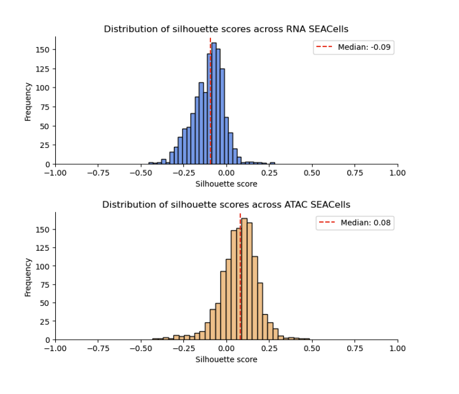
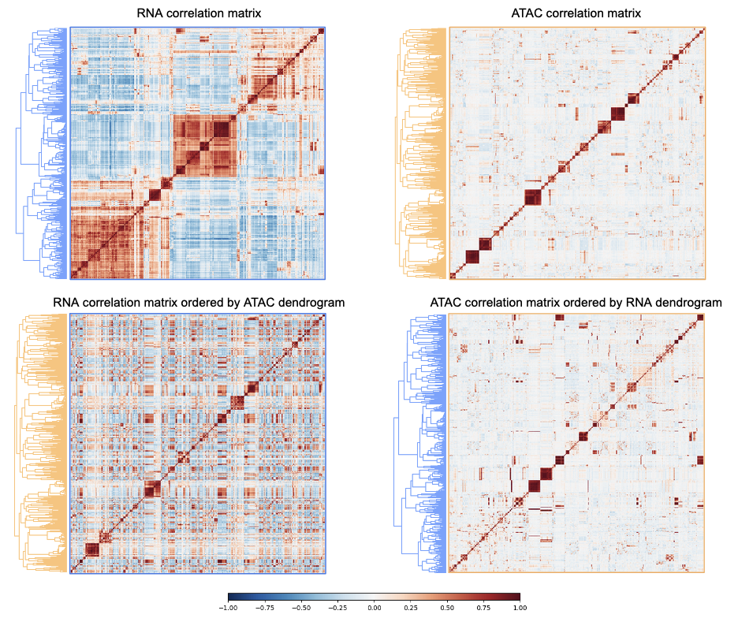
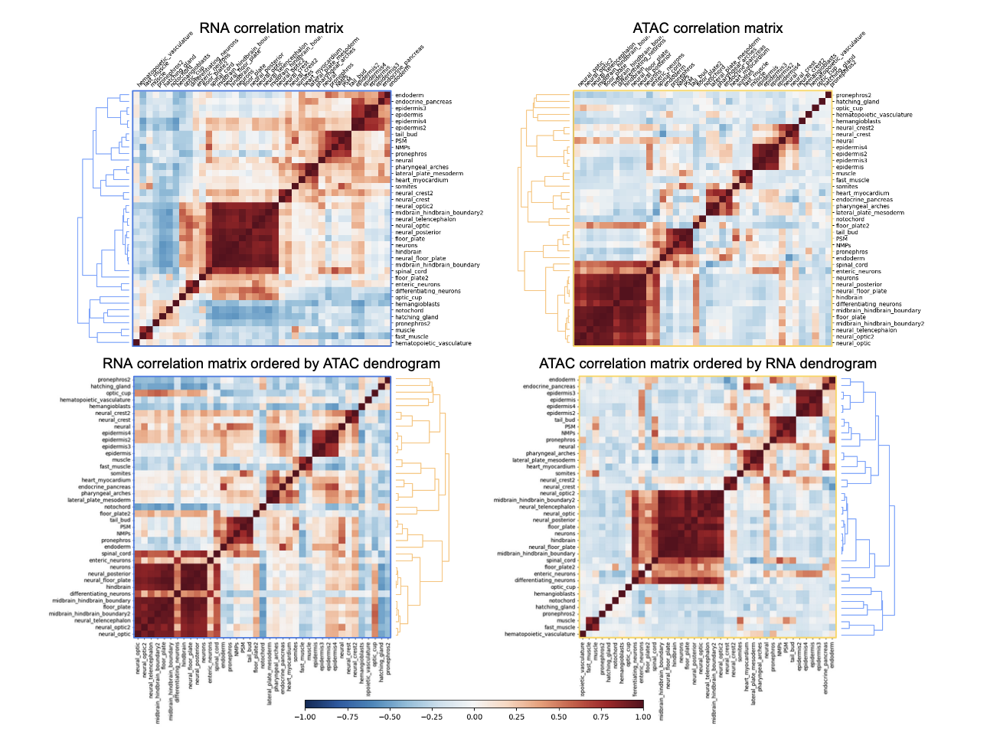

# Zebrahub Multiome metacells analysis

This repo contains the code and data for the metacells analysis using [SEACells algorithm](https://github.com/dpeerlab/SEACells/tree/main) on [Zebrahub-Multiome](https://www.biorxiv.org/content/10.1101/2024.10.18.618987v2) dataset. The hd5ad files for the RNA and ATAC data were downloaded from [drive](https://drive.google.com/drive/folders/1K3YDsXzr7f2kHx6_6pICMLhNwGOrWHDv) and placed in the respective `RNA` and `ATAC` directories. 

```
# RNA
gdown https://drive.google.com/file/d/1LNi5P4N2d9w1RC6zh4Pkk_y5Ke1Id-ym/view?usp=drive_link -O RNA/zf_multiome_atlas_full_RNA_v1_release.h5ad
# ATAC
gdown https://drive.google.com/file/d/12sixloWb6PY6O1V_0tODcLy4bGblduY1/view?usp=drive_link -O ATAC/zf_multiome_atlas_full_ATAC_v1_release.h5ad
```

The scripts to generate metacells are in `scripts/SEACell_RNA_analysis.py` and `scripts/SEACell_ATAC_analysis.py`, for RNA and ATAC data respectively. The results are saved in `RNA/out/` and `ATAC/out/` directories. 

The downstream analysis of the metacell assignments is in `SEACells.ipynb`. 

I assess the size and cell type annotation purity of metacells in the two datasets. I summarize cell-to-metacell clustering by computing silhouette scores for each cell, which measure how well each cell fits within its assigned metacells compared to other metacells.  



Because ATAC metacells have better silhouette scores, I load the cell-to-metacell assignment from the ATAC data and use those to create equivalent metacells for the RNA data (results in `RNA/out_from_ATAC` directory).  

Next, I compute the correlation between metacells in the RNA and the ATAC data, and cluster metacells in each modality using hierarchical clustering.

RNA metacell profiles share broad similarities (top row, left) which are absent from the ATAC data (top row, right), owing to the sparisty and higher dimensionality of the ATAC data. ATAC similarities are recovered in the RNA profiles when RNA metacells are ordered by the ATAC metacell clustering (bottom row, left), but the RNA broad clusters cannot be seen in the ATAC data when ordered by RNA clustering (bottom row, right).  



Broad grouping of cell types is shared betwen RNA and ATAC metacells.

